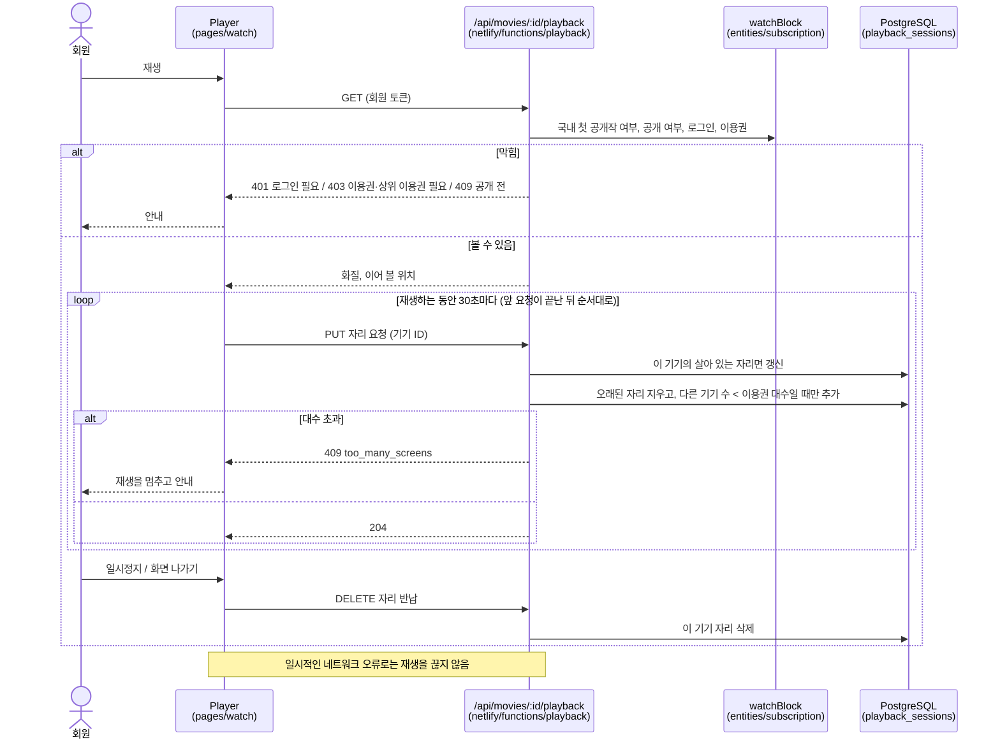
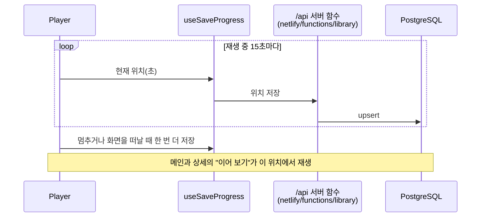
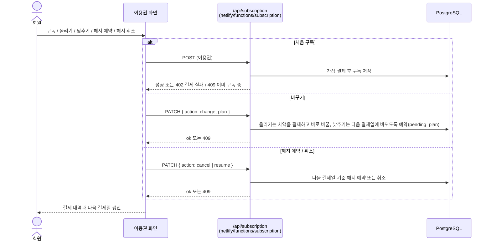

# 시퀀스 다이어그램

OnlyMovie의 주요 흐름입니다. 화면은 React(Vite), 서버는 Netlify Functions와 Netlify Database(PostgreSQL), 회원은 Netlify Identity입니다.

## 1. 재생 권한 확인과 동시 시청 제한

```mermaid
sequenceDiagram
    actor 회원
    participant 플레이어 as Player<br/>(pages/watch)
    participant 함수 as /api/movies/:id/playback<br/>(netlify/functions/playback)
    participant 규칙 as watchBlock<br/>(entities/subscription)
    participant DB as PostgreSQL<br/>(playback_sessions)

    회원->>플레이어: 재생
    플레이어->>함수: GET (회원 토큰)
    함수->>규칙: 국내 첫 공개작 여부, 공개 여부, 로그인, 이용권
    alt 막힘
        함수-->>플레이어: 401 로그인 필요 / 403 이용권·상위 이용권 필요 / 409 공개 전
        플레이어-->>회원: 안내
    else 볼 수 있음
        함수-->>플레이어: 화질, 이어 볼 위치
        loop 재생하는 동안 30초마다 (앞 요청이 끝난 뒤 순서대로)
            플레이어->>함수: PUT 자리 요청 (기기 ID)
            함수->>DB: 이 기기의 살아 있는 자리면 갱신
            함수->>DB: 오래된 자리 지우고, 다른 기기 수 < 이용권 대수일 때만 추가
            alt 대수 초과
                함수-->>플레이어: 409 too_many_screens
                플레이어-->>회원: 재생을 멈추고 안내
            else
                함수-->>플레이어: 204
            end
        end
        회원->>플레이어: 일시정지 / 화면 나가기
        플레이어->>함수: DELETE 자리 반납
        함수->>DB: 이 기기 자리 삭제
    end
    Note over 플레이어,함수: 일시적인 네트워크 오류로는 재생을 끊지 않음
```

## 2. 이어 보기 저장

```mermaid
sequenceDiagram
    participant 플레이어 as Player
    participant 변이 as useSaveProgress
    participant 함수 as /api 서버 함수<br/>(netlify/functions/library)
    participant DB as PostgreSQL

    loop 재생 중 15초마다
        플레이어->>변이: 현재 위치(초)
        변이->>함수: 위치 저장
        함수->>DB: upsert
    end
    플레이어->>변이: 멈추거나 화면을 떠날 때 한 번 더 저장
    Note over 플레이어,DB: 메인과 상세의 "이어 보기"가 이 위치에서 재생
```

## 3. 이용권 바꾸기 (가상 결제)

```mermaid
sequenceDiagram
    actor 회원
    participant 화면 as 이용권 화면
    participant 함수 as /api/subscription<br/>(netlify/functions/subscription)
    participant DB as PostgreSQL

    회원->>화면: 구독 / 올리기 / 낮추기 / 해지 예약 / 해지 취소
    alt 처음 구독
        화면->>함수: POST (이용권)
        함수->>DB: 가상 결제 후 구독 저장
        함수-->>화면: 성공 또는 402 결제 실패 / 409 이미 구독 중
    else 바꾸기
        화면->>함수: PATCH { action: change, plan }
        함수->>DB: 올리기는 차액을 결제하고 바로 바꿈, 낮추기는 다음 결제일에 바뀌도록 예약(pending_plan)
        함수-->>화면: ok 또는 409
    else 해지 예약 / 취소
        화면->>함수: PATCH { action: cancel | resume }
        함수->>DB: 다음 결제일 기준 해지 예약 또는 취소
        함수-->>화면: ok 또는 409
    end
    화면-->>회원: 결제 내역과 다음 결제일 갱신
```
